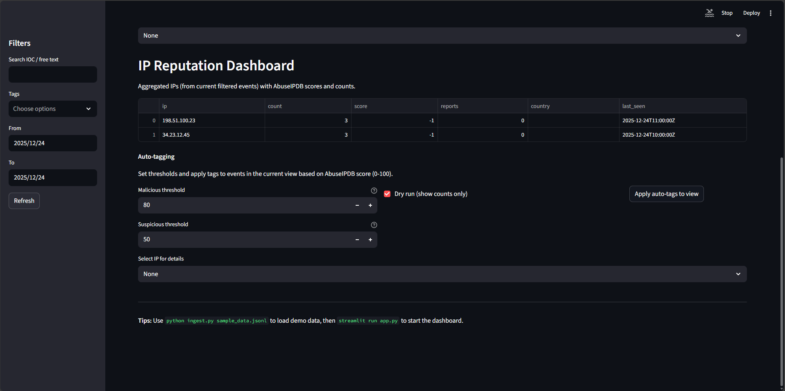
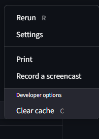
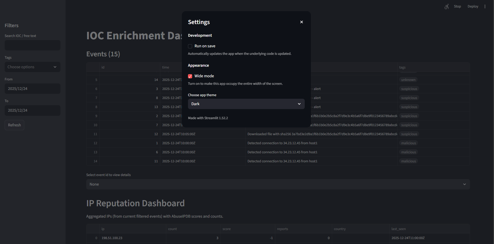

# soc-ioc-enrichment-dashboard

IOC enrichment dashboard for SOC — ingest, enrich, and visualize indicators of compromise (IOCs).

## Overview
A lightweight IOC enrichment and visualization dashboard for SOC analysts. Ingests indicator feeds, enriches them with external sources (e.g., AbuseIPDB), stores results, and provides an interactive web UI for triage and investigation.

## Screenshots

### IOC Enrichment Dashboard

### IP Reputation Dashboard

### Auto-Tagging & SOAR Logic

### Application Settings (Streamlit)

## Key features
- Ingest IOC data from files or streams (JSONL sample included)
- Enrich IPs/URLs with external lookups and local exporters
- Simple Flask web UI to browse, search, and triage IOCs
- CLI scripts for ingestion/export and automation
- MIT license

## Quickstart
1. Create and activate virtual environment
   - PowerShell:
     - `python -m venv .venv`
     - `& .venv\Scripts\Activate.ps1`
2. Install dependencies:
   - `pip install -r requirements.txt`
3. Copy configuration:
   - `copy .env.example .env` (edit as needed)
4. Ingest sample data:
   - `python ingest.py sample_data.jsonl`
5. Start the app:
   - `python app.py`
6. Open: `http://localhost:5000`

> Tip: Use `.env.example` to populate API keys (e.g., AbuseIPDB) before running enrichers.

## Configuration
See `.env.example` for configurable variables (API keys, DB path, debug mode, ports).

## Contributing
- Open issues for bugs/feature requests.
- Fork, create a feature branch, add tests, and submit a PR.
- Keep changes small and document behavior in code/comments.

## License
MIT — see `LICENSE`.
